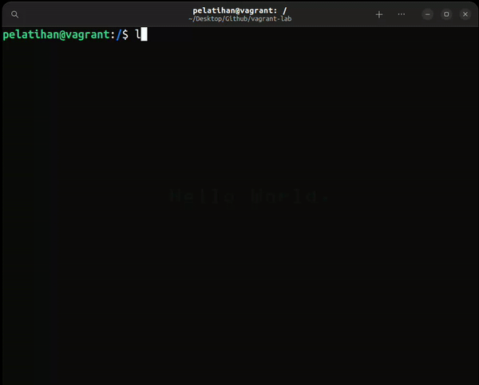
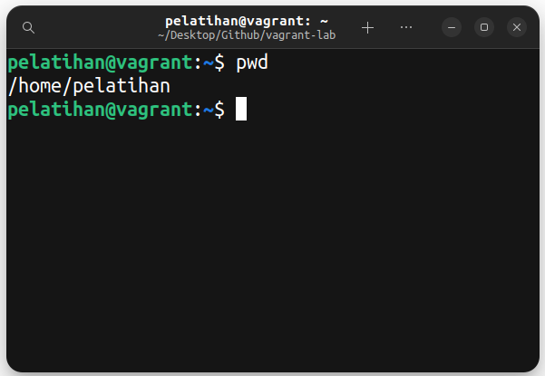

## Table of Contents

- [i. Capaian](#capaian)
- [ii. Prasyarat](#prasyarat)
- [iii. Daftar Isi](#daftar-isi)
- [1. Perkenalan Linux](#perkenalan-linux)
  - [1.1. Sistem Operasi](#apa-itu-sistem-operasi)
  - [1.2. Komparasi Linux dan OS Lain](#perbedaan-linux-dan-os-lainnya)
  <!-- - [1.3 Distro Linux](#distro-linux) -->
- [2. Filesystem and Ownership](#filesystem-and-ownership)
  - [2.1. Filesystem](#filesystem)
  - [2.2. Struktur Direktori](#struktur-direktori)
  - [2.3. Manajemen User dan Group](#manajemen-user-dan-group)
- [3. Process and Monitoring](#process-and-monitoring)
  - [3.1. Package dan Source Control](#package-dan-source-control)
  - [3.2. Process](#apa-itu-process)
  - [3.3. Foreground vs Background Process](#foreground-vs-background-process)
  - [3.4. Perintah Terkait Process](#perintah-terkait-process)
- [4. Shell Scripting and Automation](#shell-scripting-and-automation)
  - [4.1. Text Editor](#text-editor)
  - [4.2. Shell Scripting](#shell-scripting)
  <!-- - [4.3. Cronjob](#cronjob) -->
- [iv. Referensi](#referensi)

# Perkenalan Linux

## Apa Itu Sistem Operasi?

Sistem operasi (OS) adalah perangkat lunak yang bertindak sebagai perantara antara perangkat keras komputer dan pengguna. Mengelola perangkat keras komputer dan menyediakan layanan penting untuk berbagai aplikasi. Menjadi jembatan bagi pengguna untuk berinteraksi dengan komputer dan komponennya.

### Fungsi Utama Sistem Operasi

- Pengelola Sumber Daya

- Manajemen Proses

- Manajemen Memori

- Manajemen File System

- User Interface

## Perbedaan Linux dan OS Lainnya

### Apa sih Linux ?!?!?

Linux adalah nama yang diberikan kepada sistem operasi bertipe Unix. Linux merupakan salah satu contoh hasil pengembangan perangkat lunak bebas dan sumber terbuka utama (<i>open source</i>). Seperti perangkat lunak bebas dan sumber terbuka lainnya pada umumnya, kode sumber Linux dapat dimodifikasi, digunakan dan didistribusikan kembali secara bebas oleh siapa saja. Dengan kata lain, kalian pun juga bisa berkontribusi untuk mengembangkan linux menjadi sistem operasi yang lebih baik kedepannya.

### Pros and Cons

Beberapa kelebihan Linux adalah bersifat Open Source, kustomisasi tinggi, serta memiliki keamanan, stabilitas, dan kinerja yang handal. Sayangnya, tidak semua perangkat lunak maupun perangkat keras mendukung penggunaan Linux. Kalau kalian suka main game, beberapa aplikasi dan permainan populer, seperti Valorant, tidak tersedia.

# Filesystem and Ownership

## Filesystem

Filesystem mendeskripsikan data yang kita punya. Dengan filesystem kita bisa letak dari suatu file atau direktrori, akses terhadap suatu data. Tanpa Filesystem, kita tidak akan mengetahui di mana sesuatu disimpan, di mana segala sesuatu dimulai atau berakhir.

### Linux Filesystem

Filesystem di Linux adalah bagian dari sistem operasi yang mengatur dan mengelola data di penyimpanan, seperti hard disk. Filesystem membantu dalam:

- Mengatur file di dalam disk
- Mengelola nama file
- Menyimpan ukuran file
- Mencatat tanggal pembuatan file
- Menyimpan informasi lain tentang file

Filesystem ini penting untuk memastikan semua data tersimpan dengan rapi dan mudah diakses.

### Struktur Filesystem

Filesystem di Linux memiliki struktur berkas hierarkis, yaitu sistem berkas yang tersusun seperti pohon:

1. Direktori Utama (Root Directory): Direktori paling atas.
2. Subdirektori: Direktori yang ada di bawah root dan direktori lainnya.

Setiap direktori dan subdirektori bisa diakses dari root directory. Biasanya, satu partisi disk punya satu filesystem, tapi bisa juga lebih dari satu. Filesystem dirancang untuk mengelola data di penyimpanan yang tidak mudah hilang (non-volatile) dan menyediakan ruang untuk menyimpan data.

Semua sistem berkas memerlukan namespace, yaitu metodologi penamaan dan pengorganisasian. Namespace menentukan proses penamaan, panjang nama file, atau subset karakter yang dapat digunakan untuk nama file. Namespace juga menentukan struktur logis file pada segmen memori, seperti penggunaan direktori untuk mengatur file tertentu.

### Explore Filesystem

Untuk menjelajahi filesystem, kita bisa menggunakan beberapa commands atau perintah:

### Navigation Command

#### 1. ls

`list`. Untuk menampilkan list atau daftar file-file apa saja yang ada disuatu directory. Parameter yang sering dipakai pada perintah ls adalah `-a`, `-l`, `-t`, `-h`, dan `-r`. Parameter digunakan untuk menentukan output yang kita inginkan. Parameter bisa digabungkan, dan urutan letak parameter tidak memengaruhi hasil.

<!--  -->

#### 2. pwd

`print working directory`. Untuk mengetahui di directory mana kita berada sekarang.

<!--  -->

#### 3. cd

`change directory`. Digunakan untuk pindah ke directory lain. Syntax-nya adalah `cd <nama_directory>`. Misalnya kita sedang berada di directory /home/pelatihan dan ingin berpindah ke directory `/usr/share`. Maka command yang kita gunakan adalah `cd /usr/share`.

Contoh lain:

- `cd` atau `cd ~` untuk pindah ke directory home user
- `cd /` untuk pindah ke directory root
- `cd ..` untuk pindah ke parent directory dari directory sekarang
- `cd -` untuk kembali ke working directory sebelumnya

<!--  -->

### Manipulation Command

#### 1. cp

`copy`. Sesuai namanya maka command ini bertugas untuk copy (salin) file atau direktori.

#### 2. mv

`move`. Digunakan untuk memindahkan suatu file atau direktori secara permanen. Command `mv` juga bisa digunakan untuk me-rename file atau direktori.

<!-- ## Linux File Permissions and Ownerships

Secara desain, Linux adalah sistem operasi multi-user. Dalam sistem perusahaan, akan ada banyak pengguna yang mengakses sistem yang sama. Namun jika ada pengguna yang bisa mengakses dan memodifikasi seluruh file milik pengguna lain atau file sistem, hal ini tentu akan menimbulkan risiko keamanan.

Inilah sebabnya mengapa Linux memiliki langkah-langkah keamanan. Hal ini agar memastikan bahwa file atau direktori dapat diakses, dimodifikasi atau dijalankan (dieksekui) hanya oleh pengguna yang diinginkan.

### File ownership

Setiap sistem Linux memiliki tiga jenis pemilik:

1. User: User atau pengguna adalah orang yang membuat file. Secara default, siapa pun yang membuat file akan menjadi pemilik file tersebut. Pengguna dapat membuat, menghapus, atau memodifikasi file.

2. Group: Sebuah grup dapat berisi banyak pengguna. Semua pengguna atau user yang tergabung dalam grup memiliki izin akses yang sama untuk suatu file.

3. Other: Siapa pun yang memiliki akses ke file selain pengguna dan grup masuk dalam kategori lainnya.

User dan Group dikelola secara lokal di `/etc/psswd` atau `/etc/group`.

Untuk mengecek User dan Group kita bisa menggunakan command `ls -l`


Setiap file dan direktori di sistem UNIX/Linux memiliki 3 tipe permission atau izin sebagi berikut.

- `Read` - Izin ini memberi kita wewenang untuk membuka dan membaca file.
- `Write` - Izin write atau menulis memberi kita wewenang untuk mengubah konten file. Izin menulis pada direktori memberi kita wewenang untuk menambah, menghapus, dan mengganti nama file yang disimpan dalam direktori.
- `Execute` - Di Windows, program yang dapat dieksekusi biasanya memiliki ekstensi “.exe” dan dapat kita jalankan dengan mudah. Di Unix/Linux, kita tidak dapat menjalankan program kecuali izin eksekusi telah ditetapkan. Jika izin eksekusi tidak disetel, kita mungkin masih dapat melihat/memodifikasi kode program (asalkan izin read & write disetel), tetapi tidak dapat menjalankannya.

Simbol dari masing-masing permission:

- r – Read
- w – Write
- x – Execute


## Manajemen User dan Group

### Membuat User

Di Linux ada beberapa command yang bisa kita gunakan untuk membuat user baru, yaitu:

#### 1. useradd

Command ini sangat sederhana, sehingga diperlukan parameter tambahan untuk menyiapkan akun sepenuhnya.

```bash
sudo useradd ajk
```

```bash
sudo useradd -d /home/ajk -m -s/bin/bash ajk && passwd ajk
```

Karena cukup sederhana jadi kita poerlu menambahkan beberapa parameter, `-d` untuk menambahkan direktori di baru di `/home`, `-s` default yang akan digunakan, `passwd` untuk mengatur kata sandi dari user yang dibuat.

#### 2. adduser

### Membuat Group

Untuk membuat group baru di Linux bisa menggunakan command `groupadd`:

```bash
sudo groupadd pelatihan
```


# Process and Monitoring

## Package dan Source Control

Pada masa-masa awal Linux, program hanya didistribusikan sebagai kode sumber, bersama dengan halaman manual yang diperlukan, file konfigurasi yang diperlukan, dan banyak lagi. Saat ini, sebagian besar distributor Linux menggunakan program bawaan atau kumpulan program yang disebut package, yang disajikan kepada pengguna yang siap untuk diinstal pada distribusi tersebut. Berikut beberapa kkonsep dalam package management yang perlu diketahui :

- Repository

  Repositori adalah penyimpanan sentral tempat paket perangkat lunak disimpan dan dikelola. Repositori ini berisi berbagai perangkat lunak yang telah dikompilasi untuk digunakan pada distribusi Linux tertentu. Repository ini yang nantinya akan diakses oleh package manager untuk menginstal package yang dibutuhkan. List konfigurasi dapat dikonfigurasi pada path `/etc/apt/sources.list` jika pada distro ubuntu. Contohnya ini adalah [repository ubuntu lokal yang ada di Indonesia](https://nugi.biz/2022/03/22/repository-lokal-indonesia-ubuntu-22-04-lts-jammy-jellyfish.xhtml).

- Package

  package adalah suatu unit perangkat lunak yang telah dikemas bersama dengan informasi tambahan yang diperlukan untuk instalasi dan manajemen perangkat lunak tersebut. Contohnya adalah pacakge `.deb` jika di distro debian dan `.exe` jika pada windows. Package ini berisi file yang dibutuhkan oleh user untuk menjalankan suatu program. File yang dibutuhkan oleh user untuk menjalankan suatu program ini disebut dengan `binary file`. Binary file ini berisi kode program yang sudah dikompilasi. Kode program yang sudah dikompilasi ini akan dijalankan oleh kernel. Kernel adalah bagian dari sistem operasi yang bertugas untuk mengatur semua sumber daya yang ada pada komputer.

  perbedaan package pada linux dan windows adalah pada linux package yang diinstal akan disimpan pada path `/usr/bin` sedangkan pada windows package yang diinstal akan disimpan pada path `C:\Program Files`. Untuk melihat package apa saja yang sudah terinstal pada linux dapat menggunakan command `dpkg -l` atau `apt list --installed`.

- Dependency

  Dependency adalah suatu package yang dibutuhkan oleh package lainnya untuk bisa berjalan. Contohnya adalah package `libssl-dev` yang dibutuhkan oleh package `nginx` untuk bisa berjalan. Package `libssl-dev` ini disebut dengan package dependensi. Package dependensi ini akan diinstal secara otomatis oleh package manager jika package utama diinstal. Untuk melihat package apa saja yang dibutuhkan oleh package lainnya dapat menggunakan command `apt-cache depends <package-name>`.

- Package Manager

  Package manager adalah perangkat lunak yang dirancang untuk membantu pengguna mengelola instalasi, pembaruan, konfigurasi, dan penghapusan perangkat lunak pada sistem operasi. Package Manager dapat dikelompokkan menjadi 2 jenis yaitu `low-level` dan `high-level`. Seperti pada contoh dibawah ini :

  

  contohnya dpkg pada debian hanya bisa menginstal package .deb yang sudah tersedia pada host saja, sedangkan apt bisa menginstal package .deb dan juga bisa menginstal package dependensinya dari repository. Package manager yang berada diatas package manager lainnya disebut dengan high-level package manager. Package manager yang berada dibawah package manager lainnya disebut dengan low-level package manager.

  Selain itu ada pacakage manager yang compatible di multi distro linux seperti `snap` dan `flatpak`. Snap dan flatpak ini berbeda dengan package manager lainnya karena package yang diinstal menggunakan snap dan flatpak akan diisolasi dari package lainnya. Snap dan flatapak ini sudah tersedia pada repository ubuntu. Sehingga bisa langsung diinstal dengan command `apt-get install snapd` dan `apt-get install flatpak`.

  Contohnya adalah jika kita menginstal package `nginx` menggunakan apt, maka package `nginx` akan diinstal pada path `/usr/bin/nginx` dan package `nginx` ini bisa diakses oleh package lainnya. Sedangkan jika kita menginstal package `nginx` menggunakan snap, maka package `nginx` akan diinstal pada path `/snap/bin/nginx` dan package `nginx` ini tidak bisa diakses oleh package lainnya. Untuk melihat package apa saja yang sudah terinstal menggunakan snap dapat menggunakan command `snap list`.

  Sedangkan Flatpak ini berbeda dengan snap karena package yang diinstal menggunakan flatpak akan diinstal pada path `/var/lib/flatpak` dan package ini juga tidak bisa diakses oleh package lainnya. Untuk melihat package apa saja yang sudah terinstal menggunakan flatpak dapat menggunakan command `flatpak list`.

  

<div align=center>


</div>

Jadi kesimpulannya user linux akan menggunakan command package manager untuk menginstal package yang dibutuhkan. Package manager akan mengambil package yang dibutuhkan dari repository yang sudah dikonfigurasi sebelumnya. Package yang dibutuhkan tersebut bisa berupa package utama atau package dependensi. Package utama adalah package yang dibutuhkan oleh user untuk bisa berjalan. Package dependensi adalah package yang dibutuhkan oleh package utama untuk bisa berjalan.

## Command Package Management

Beberapa command yang dapat dilakukan untuk memanage package pada linux yang sering digunakan adalah sebagai berikut :

- `apt-get update`

  Command ini digunakan untuk mengupdate list package yang ada pada repository. Command ini harus dijalankan sebelum menginstal package agar package yang diinstal adalah package terbaru.

- `apt-get install <package-name>`
  Command ini digunakan untuk menginstal package yang dibutuhkan. Contohnya adalah `apt-get install nginx`.

- `apt-get remove <package-name>`
  Command ini digunakan untuk menghapus package yang sudah terinstal. Contohnya adalah `apt-get remove nginx`.

- `apt-get purge <package-name>`
  Command ini digunakan untuk menghapus package yang sudah terinstal beserta konfigurasinya. Contohnya adalah `apt-get purge nginx`.

- `apt-get autoremove`
  Command ini digunakan untuk menghapus package yang sudah terinstal dan tidak dibutuhkan oleh package lainnya. Contohnya adalah `apt-get autoremove`.

- `apt-get upgrade`
  Command ini digunakan untuk mengupgrade package yang sudah terinstal.

  Selain command command diatas masih banyak lagi command yang dapat digunakan untuk melihatnya dapat menggunakan command `apt-get --help` atau mengunjungi [link berikut](https://www.tecmint.com/useful-basic-commands-of-apt-get-and-apt-cache-for-package-management/).

Selain menggunakan `apt-get`, package juga dapat diinstal menggunakan command `dpkg`. Command ini digunakan untuk menginstal package yang sudah terdownload. Contohnya adalah `dpkg -i nginx.deb`. dengan syarat kita sudah memiliki file yang akan diinstal terlebih dahulu beda dengan `apt-get` yang akan mengambil package dari repository. untuk mengetahui command apa saja yang dapat dilakukan dengan `dpkg` dapat menggunakan command `dpkg --help`.

## Apa Itu Process?

Process adalah suatu kode program yang sedang berjalan di memory. Setiap process memiliki ID yang unik yang disebut dengan PID. PID ini digunakan untuk mengidentifikasi process yang sedang berjalan. Untuk Lebih jelasnya dapat dilihat pada gambar dibawah ini :

<div align=center>


</div>

Berikut adalah daur hidup dari suatu process pada sistem operasi linux :

Pada state `Created` process belum dijalankan oleh kernel. Setelah dijalankan oleh kernel process akan berada pada state `Running`. Setelah process selesai dijalankan oleh kernel process akan berada pada state `Terminated`. Setelah process berada pada state Terminated, process akan dihapus dari memory dan akan berada pada state Zombie.

- `Zombie process` adalah process yang sudah selesai dijalankan oleh kernel namun masih ada di memory. Zombie process ini akan dihapus dari memory setelah parent processnya memanggil wait() system call.

- Process juga memiliki parent process yang merupakan process yang membuat process tersebut. Process yang dibuat oleh parent process disebut dengan `child process`.

- Process yang tidak memiliki parent process disebut dengan `init process`. Init process ini adalah process pertama yang dijalankan oleh kernel saat booting. Init process ini memiliki PID 1.

## Foreground vs Background Process

Berdasarkan cara untuk proses dijalankan, proses terbagi menjadi 2 yaitu foreground process dan background process.

- `Foreground process` adalah proses yang dijalankan secara interaktif. Contohnya adalah saat kita menjalankan command `apt update` pada terminal. Saat menjalankan command tersebut terminal akan terblokir dan tidak bisa menjalankan command lainnya sampai command tersebut selesai dijalankan.

- `Background process` adalah proses yang dijalankan secara non-interaktif. Contohnya adalah saat kita menjalankan command `apt update &` pada terminal. Saat menjalankan command tersebut terminal tidak akan terblokir dan bisa menjalankan command lainnya. Untuk melihat process yang sedang berjalan dapat menggunakan command `jobs`.


Pada gambar diatas terlihat command `sleep` dijalankan pada foreground maka terminal akan terblokir dan tidak bisa menjalankan command lainnya. Sedangkan pada gambar dibawah command `sleep` dijalankan pada background maka terminal tidak akan terblokir dan bisa menjalankan command lainnya dan dapat dilihat dengan perintah `jobs`.

Namun terkadang `&` tetap berjalan di foreground, solusinya dapat menggunakan `nohup`, `nohup` adalah command yang digunakan untuk menjalankan command pada background dan tidak akan terpengaruh oleh SIGHUP (signal hangup) yang dikirimkan saat terminal ditutup. Contohnya adalah `nohup ping &`. namun nohup perlu diinstal terlebih dahulu dengan command `sudo apt-get install coreutils`.

## Perintah Terkait Process

1. Berikut adalah beberapa perintah yang dapat digunakan untuk melihat process yang sedang berjalan :

- `ps` dan `ps aux`

  Command ini digunakan untuk melihat process yang sedang berjalan. Command yang paling sering digunakan adalah `ps -aux`. dengan arti argumen a untuk melihat semua process, u untuk menampilkan informasi lebih ranci, dan x untuk melihat semua proses tanpa terikat oleh previlage user tertentu.

  

- `pstree`

  Dan ada juga command `pstree` yang digunakan untuk melihat process yang sedang berjalan dalam bentuk tree (terlihat hubungan parent dan child), namun harus diinstal terlebih dahulu dengan command `apt-get install pstree`.

  

2. berikut adalah beberapa perintah yang dapat digunakan untuk menghentikan process yang sedang berjalan :

- `kill` dan `pkill`

  Command ini digunakan untuk menghentikan process yang sedang berjalan. Command ini dapat digunakan dengan menggunakan PID. Contohnya adalah `kill -<nomor signal> 1234`, jika tidak menyebutkan nomor signalnya maka akan menggunakan signal 15 (SIGTERM). Sedangankan pkill dapat digunakan dengan menggunakan nama process. Contohnya adalah `pkill -<nomor signal> nginx`. Untuk informasi selngkapnya bisa gunakan command `kill --help` atau `pkill --help`.

- `kill -l`

  Command ini digunakan untuk melihat daftar signal yang dapat digunakan untuk menghentikan process.
  
  Untuk lebih memahami setiap arti signal yang ada bisa mengunjungi [link berikut](https://www.man7.org/linux/man-pages/man7/signal.7.html).

3.  Berikut adalah beberapa perintah yang dapat digunakan untuk memonitoring process yang sedang berjalan :

- `top ` dan `htop`

  Command ini dapat digunakan untuk memonitoring dan menghentikan process yang sedang berjalan. Namun untuk htop haru diinstal terlebih dahulu dengan command `apt-get install htop` sedangkan top sudah terinstall secara default.

  
  

- `lsof`

  Command ini digunakan untuk melihat file mana yang diakses oleh suatu process. Contohnya adalah `lsof -p 1` dengan arti -p untuk melihat file yang sedang digunakan oleh process dengan PID 1, atau bisa menggunakan argumen -c untuk melihat file yang sedang digunakan oleh process dengan nama tertentu seperti `lsof -c docker`.

  

- `netstat`

  Command ini digunakan untuk melihat port yang sedang digunakan oleh suatu process. Contohnya adalah `netstat -tulpn` dengan arti -t untuk melihat port TCP, -u untuk melihat port UDP, -l untuk melihat port yang sedang mendengarkan, -p untuk melihat process yang sedang menggunakan port tersebut, dan -n untuk melihat port dalam bentuk angka.

  

- `whereis` dan `which`

  Command `which` digunakan untuk menemukan lokasi eksekusi dari suatu perintah. Sedangkan `whereis` lebih detail yaitu dapat digunakan untuk menemukan lokasi eksekusi, source code, dan manual dari suatu perintah. Contohnya adalah `which ls` dan `whereis ls`. jika ingin tahu argumen apa saja yang tersedia untuk `whereis` dapat menggunakan command `whereis --help`.

  

# Shell Scripting and Automation

## Text Editor

Dalam linux, text editor yang sering digunakan adalah nano dan vim. Dua text editor tersebut dapat berjalan pada command line interface (CLI).

### Nano

Nano merupakan teks editor yang termasuk mudah dipahami karena terdapat shortcut pada bagian bawah layar. Untuk membuka file menggunakan nano, dapat menggunakan perintah berikut.

```sh
nano [nama-file]
```

Jika tidak bisa menggunakan perintah tersebut, berarti `nano` belum terinstall. Untuk melakukan instalasi `nano` dapat menggunakan perintah berikut.

```sh
sudo apt update
sudo apt install nano -y
```

Pada contoh kali ini akan digunakan untuk mengedit file `contoh.txt`.

```sh
nano contoh.txt
```


Pada interface tampilan shortcut, simbol `^` sama dengan tombol `Ctrl` dan simbol `M-` sama dengan tombol `Alt`. Contoh penggunaannya adalah untuk melihat daftar shortcut yang dapat digunakan pada nano menggunakan shortcut `Ctrl + G`.


Untuk keluar dari tampilan bantuan, dapat menggunakan tombol `Q`. Setelah mengubah isi dari file yang ingin diubah, file dapat disimpan menggunakan shortcut `Ctrl + O`.


Kemudian akan muncul pertanyaan `File Name to Write: ` yang dapat diisi nama hasil file yang ingin disimpan. Setelah itu dapat ditekan `Enter`.

Ketika ingin keluar dari text editor secara langsung tanpa menyimpan file, dapat menggunakan shortcut `Ctrl + X`. Tekan `N` jika tidak ingin menyimpan perubahan atau `Y` untuk menyimpan perubahannya.


### Vim

Vim merupakan salah satu text editor yang mempunyai fitur lengkap untuk melakukan pengeditan pada file. Namun, text editor ini memiliki tampilan dan shortcut yang cukup rumit untuk dimengerti bagi pemula.

Untuk membuka file menggunakan vim, dapat menggunakan perintah berikut.

```sh
vim [nama-file]
```

Jika tidak bisa menggunakan perintah tersebut, berarti `vim` belum terinstall. Untuk melakukan instalasi `vim` dapat menggunakan perintah berikut.

```sh
sudo apt update
sudo apt install vim -y
```

Pada contoh kali ini akan digunakan untuk mengedit file `contoh.py`.

```sh
vim contoh.py
```


Pada tampilan awal, vim akan memasuki mode `normal`. Untuk masuk ke mode `insert`, dapat dilakukan dengan menekan tombol `i`. Dalam mode `insert`, dapat dilakukan penulisan karakter atau teks. Untuk kembali ke mode `normal`, dapat dilakukan dengan menekan tombol `Esc`.


Dalam mode `normal`, kursor dapat digerakkan menggunakan tombol `h` untuk ke kiri, `j` untuk ke bawah, `k` untuk ke atas, dan `l` untuk ke kanan.

Untuk melakukan undo dapat dilakukan dengan menekan `u` pada mode `normal` atau `Alt + U` pada mode `insert`. Sedangkan untuk melakukan redo dapat dilakukan dengan menekan `Ctrl + R` pada mode `normal`

Untuk menyimpan file yang telah diedit, dapat mengetikkan `:w` pada mode `normal`. Atau jika ingin keluar setelah menyimpan file, dapat mengetikkan `:wq` pada mode `normal`. Namun jika ingin keluar tanpa menyimpan perubahan, dapat dilakukan dengan mengetikkan `:q!` pada mode `normal`.

Eksplorasi lebih lanjut dari text editor vim dapat dilakukan dengan mengakses tutorial vim dari terminal dengan perintah berikut.

```sh
vimtutor
```


## Shell Scripting

Shell scripting atau pemrograman shell adalah penyusunan beberapa perintah shell menjadi satu file yang melakukan serangkaian tugas tertentu. Pemrograman shell pada linux mirip dengan bahasa pemrograman yang berbasis intrepeter lainnya seperti python dan javascript.

### Operasi Dasar Shell

Berikut adalah beberapa operasi dasar pada shell.

#### Redirection

Terdapat beberapa macam redirection pada shell sebagai berikut.

- Isi dari file b akan diganti dengan output perintah a dengan operasi `a > b`

  ```sh
  ls -l > dir.txt
  # hasil output ls -l akan dikirim ke file dir.txt
  # akan membuat file dir.txt jika belum ada
  ```

- Output dari perintah a ditambahkan ke file b dengan operasi `a >> b`

  ```sh
  ls -la >> dir.txt
  # hasil output dari ls -la akan ditambahkan pada akhir file dir.txt
  ```

- Input dari perintah a adalah file b dengan operasi `a < b`

  ```sh
  sort < dir.txt
  # input dari sort merupakan file dir.txt
  ```

- Isi dari file b akan diganti dengan error dari perintah a dengan operasi `a 2> b`

  ```sh
  rm testfile.txt 2> error.log
  # error dari perintah tersebut akan dikirim ke file error.log
  # akan membuat file error.log jika belum ada
  ```

- Error dari perintah a ditambahkan ke file b dengan operasi `a 2>> b`

  ```sh
  rm anotherfile.txt 2>> error.log
  # error dari perintah tersebut akan ditambahkan pada akhir file error.log
  ```

#### Pipe

Output dari perintah a dapat dijadikan input perintah b menggunakan operator pipe `a | b`.

```sh
ls -l | sort | head -5
# output dari ls -l akan dijadikan input dari sort
# output dari sort akan dijadikan input dari head -5
# output dari head -5 akan dikeluarakan di terminal
```


#### Wildcard

Perintah dalam shell juga dapat menggunakan wildcard atau karakter sembarang yang dapat mengisi string. Berikut adalah jenis-jenis dari wildcard yang bisa digunakan dalam shell.

- Untuk menggantikan semua string dapat menggunakan `*`

  ```sh
  ls *.txt
  # akan menampilkan list file dengan ekstensi .txt
  ```

- Untuk menggantikan satu huruf saja dapat menggunakan `?`

  ```sh
  ls a?a.txt
  # akan menampilkan list file dengan nama file awal a
  # kemudian huruf sembarang dan selanjutnya huruf a
  ```

- Untuk menggantikan satu huruf dengan huruf tertentu saja dapat menggunakan `[]`

  ```sh
  ls a[dp]a.txt
  # akan menampilkan list file dengan nama file awal a
  # kemudian huruf d atau p dan selanjutnya huruf a
  ```

  ```sh
  ls a[p-s].txt
  # akan menampilkan list file dengan nama file awal a
  # kemudian huruf antara p hingga s selanjutnya huruf a
  ```

Berikut adalah hasil dari perintah dengan wildcard di atas.


Agar mendapatkan hasil yang sama dapat menggunakan perintah berikut untuk membuat file dengan nama-nama seperti di atas.

```sh
touch apa.txt ada.txt ara.txt asa.txt
```

### Shell Script Sederhana

Untuk membuat shell script sederhana, dapat dilakukan dengan membuat file dengan ekstensi `.sh`.

```sh
nano hello.sh
```

Di dalam script `hello.sh` dapat dituliskan beberapa perintah shell. Namun sebelum itu, pada baris paling awal ditulis shebang `#!/bin/bash`.

Shebang berguna agar sistem mengetahui bahwa file `hello.sh` harus dijalankan oleh `/bin/bash` atau program bash. Karena file yang dibuat memiliki ekstensi `.sh`, jadi penggunaan shebang tidak terlalu berpengaruh. Jika file yang dibuat tidak memiliki ekstension apapun, maka perlu ditambahkan shebang pada baris paling awal.

```sh
#!/bin/bash

echo "Hello, world!"
```

Simpan perubahan pada file dan ubah permission dari file tersebut agar bisa dieksekusi.

```sh
chmod +x hello.sh
```


### Variabel

Sama seperti bahasa pemrograman lainnya, pada shell juga terdapat variabel. Terdapat beberapa hal yang perlu diperhatikan ketika mendefinisikan variabel.

- Nama variabel hanya boleh berisi dari karakter berikut
  - Huruf (a-z dan A-Z)
  - Angka (0-9)
  - Karakter underscore (-)
- Nama variabel dimulai dengan huruf atau underscore
- Bersifat case sensitive (huruf besar dan huruf kecil beda)

Mendeklarasikan variabel dapat dilakukan dengan operator `=`.

```sh
nama_var=nilai
```

Perlu diperhatikan bahwa tidak boleh terdapat spasi di antara `nama_var` dengan `=` dan juga `=` dengan `nilai`. Karena pada shell karakter spasi tidak diabaikan seperti bahasa pemrograman lainnya.

Untuk mengakses variabel dapat menggunakan simbol `$` sebelum nama variabel seperti berikut.

```sh
$nama_var
```

Variabel dalam shell tidak strongly typed, artinya tidak perlu dispesifikasikan tipe data variabel-nya. Berikut adalah beberapa deklarasi variabel dengan tipe datanya.

- String

  ```sh
  str1="ini string"
  str2='ini juga string'
  ```

- Number

  ```sh
  num1=19
  num2=12.5
  ```

- Array

  ```sh
  arr1=('satu' 'dua' 'tiga')
  arr2=(1 2 3)
  arr3=('satu' 2 'tiga')
  ```

  Akses variabel array dapat dilakukan dengan menggunakan sintaks berikut.

  ```sh
  ${arr1[0]} # mengakses arr1 indeks ke 0
  ${arr2[*]} # menampilkan semua elemen dari arr2
  ${#arr3[*]} # mengakses jumlah elemen dari arr3
  ```

Berikut adalah contoh penggunaan variabel dan juga keluarannya.

```sh
#!/bin/bash

str1="ini string"
str2='ini juga string'

echo $str1
echo $str2

num1=19
num2=12.5

echo $num1
echo $num2

arr1=('satu' 'dua' 'tiga')
arr2=(1 2 3)
arr3=('satu' 2 'tiga')

echo ${arr1[0]}
echo ${arr2[*]}
echo ${#arr3[*]}
```


Terdapat variabel spesial dalam shell. Variabel berikut dapat diakses tanpa perlu dideklarasikan terlebih dahulu.

| Variabel | Deskripsi                                          |
| :------: | :------------------------------------------------- |
|    $0    | Berisi nama file yang sedang dijalankan            |
|    $n    | Berisi argumen ke-n dari pemanggilan script        |
|    $#    | Jumlah argumen dari pemanggilan script             |
|   $\*    | Berisi semua argumen dari pemanggilan script       |
|    $?    | Status exit dari perintah terakhir yang dijalankan |
|    $$    | Proses ID (PID) dari shell saat ini                |

Berikut adalah contoh penggunaan variabel tersebut dan juga keluarannya.

```sh
#!/bin/bash

echo "Nama script : $0"
echo "Argumen ke-1 : $1"
echo "Argumen ke-2 : $2"
echo "Hai $1, selamat datang di kelas $2!"
echo "Total argumen : $#"
echo "Semua argumen : $*"
echo "PID : $$"
```


### Input dan Output

Untuk melakukan input dapat menggunakan perintah `read` dengan sintaks berikut.

```sh
read nama_var
```

Untuk melakukan output dapat menggunakan perintah `echo` dengan sintaks berikut.

```sh
echo $nama_var
```

Berikut adalah contoh penggunaan `read` dan `echo` beserta keluarannya.

```sh
#!/bin/bash

kelas='linux'

echo 'Siapa namamu?'
read nama
echo -e "Halo $nama!\nSelamat datang di kelas $kelas!\n"
```

Agar echo dapat merender `\n` sebagai karakter new line, perlu ditambahkan argumen `-e`.


Selain menggunakan `echo`, output dalam shell juga dapat menggunakan `printf` seperti pada bahasa C.

```sh
#!/bin/bash

str='Ini string'
num1=12.956
num2=512

printf "str: %s\n" "$str"
printf "num1: %.2f\n" $num1
printf "num2: %d\n" $num2
```


### Quoting

Terdapat beberapa metode quoting dan escaping dalam shell sebagai berikut.

| Quoting            | Deskripsi                                                                                        |
| ------------------ | ------------------------------------------------------------------------------------------------ |
| Single quote (`'`) | Semua karakter di dalam single quote akan dianggap sebagai string                                |
| Double quote (`"`) | Karakter `$`, `` ` ``, dan `\` dalam double quote dapat digunakan sebagaimana fungsinya di shell |
| Backslash (`\`)    | Karakter yang didahului backslash akan dianggap sebagai string                                   |
| Backtick (`` ` ``) | Perintah yang diletakkan dalam backtick akan dijalankan                                          |

Berikut adalah contoh penggunaan quoting dan juga keluarannya.

```sh
str='ini string'

echo '$str = "$str"'
echo "\$str = $str"
echo "pwd = `pwd`"
```


### Operator

Berikut adalah beberapa operator yang dapat dijalankan dalam shell.

#### Operator Aritmatika

| Operator | Deskripsi      |
| -------- | -------------- |
| +        | Penjumlahan    |
| -        | Pengurangan    |
| \*       | Perkalian      |
| /        | Pembagian      |
| %        | Sisa pembagian |
| ++       | Increment      |
| --       | Decrement      |

Untuk melakukan operasi aritmatika dapat menggunakan sintaks `$((10 + 2))` atau dengan perintah `expr`.

```sh
a=10
b=4

echo "a + b = $(($a + $b))"
echo "a - b = $(($a - $b))"
echo "a * b = $(($a * $b))"
echo "a / b = $(($a / $b))"
echo "a % b = $(($a % $b))"
echo "++a = $((++a))"
echo "a++ = $((a++))"
echo "--b = $((--b))"
echo "b-- = $((b--))"
```


#### Operator Relasional

| Operator | Flag Ekuivalen | Deskripsi               |
| :------: | :------------: | ----------------------- |
|    ==    |      -eq       | Sama dengan             |
|    !=    |      -ne       | Tidak sama dengan       |
|    <     |      -lt       | Kurang dari             |
|    <=    |      -le       | Kurang dari sama dengan |
|    >     |      -gt       | Lebih dari              |
|    >=    |      -ge       | Lebih dari sama dengan  |

Operator relasional dapat digunakan dengan sintaks `$(( $a > $b ))` atau menggunakan sintaks `` `[[ $a -gt $b ]]` `` jika dengan flag.

```sh
#!/bin/bash

a=10
b=4

echo "a == b : $(($a == $b))"
echo "a != b : `[[ $a -ne $b ]] && echo '1' || echo '0'`"
echo "a < b : $(($a < $b))"
echo "a <= b : `[[ $a -le $b ]] && echo '1' || echo '0'`"
echo "a > b : $(($a > $b))"
echo "a >= b : `[[ $a -ge $b ]] && echo '1' || echo '0'`"
```


#### Operator Logika

| Operator | Deskripsi  |
| -------- | ---------- |
| &&       | Logika AND |
| \|\|     | Logika OR  |
| !        | Logika NOT |

Operator logika digunakan untuk menggabungkan dua atau lebih operator relasional.

### Percabangan

Dalam shell juga terdapat percabangan seperti pada bahasa pemrograman lainnya.

Berikut adalah contoh percabangan dalam shell dan keluarannya.

```sh
#!/bin/bash

a=10
b=10

if [[ $a -gt $b ]]
then
  echo 'a > b'
elif [[ $a -lt $b ]]
then
  echo 'a < b'
else
  echo 'a == b'
fi
```


### Perulangan

Berikut adalah beberapa macam perulangan yang dapat digunakan dalam shell.

#### Perulangan While

Untuk menggunakan perulangan while dalam shell, dapat menggunakan contoh sintaks berikut.

```sh
#!/bin/bash

i=0

while [[ $i -lt 5 ]]
do
  echo $((i++))
done
```


#### Perulangan For

Untuk menggunakan perulangan for dalam shell, dapat menggunakan beberapa contoh sintaks berikut.

```sh
#!/bin/bash

for i in 1 2 3 4 5
do
  echo $i
done
```


```sh
#!/bin/bash

for (( i = 0; i < 5; i++ ))
do
  echo $i
done
```


## Cronjob

### Apa itu Con Jobs?

Cron jobs adalah sebuah proses yang dilaksanakan dalam background yang memungkinkan user dari Linux untuk menjalankan perintah atau shell script pada waktu tertentu secara otomatis. Perintah atau script yang dijalankan oleh cron merupakan cron jobs.

Untuk mengelola cron jobs dapat menggunakan perintah crontab berikut.

```sh
crontab [-u user] [-l | -r | -e] [-i]
```

Keterangan:

- `-u` untuk membuat crontab pada user tertentu
- `-l` untuk menampilkan isi file crontab
- `-r` untuk menghapus file crontab
- `-e` untuk mengubah atau membuat file crontab jika belum ada
- `-i` untuk memberikan konfirmasi sebelum menghapus file crontab

### Membuat atau Mengubah Cron Jobs

Untuk membuat atau mengubah cron jobs dapat dilakukan dengan membuka crontab menggunakan perintah berikut.

```sh
crontab -e
```

Berkut adalah isi dari crontab.

```
* * * * * perintah yang akan dijalankan
- - - - -
| | | | |
| | | | +- Hari    [0 -  6] (0 = Minggu)
| | | +--- Bulan   [1 - 12]
| | +----- Tanggal [1 - 31]
| +------- Jam     [0 - 23]
+--------- Menit   [0 - 59]
```

Untuk melihat daftar cron jobs pada crontab dapat menggunakan perintah berikut.

```sh
crontab -l
```

Berikut adalah contoh hasil crontab.


Cron job yang dimasukkan ke dalam crontab tersebut adalah untuk menjalankan perintah berikut.

- Setiap jam 0 dan menit 0 akan memasukkan hasil dari `ls ~` ke `~/list-files`
- Setiap minggu menjalankan `~/hello.sh`

Untuk referensi lebih lanjut mengenai perintah crontab dapat mengakses situs [crontab.guru](https://crontab.guru). -->
