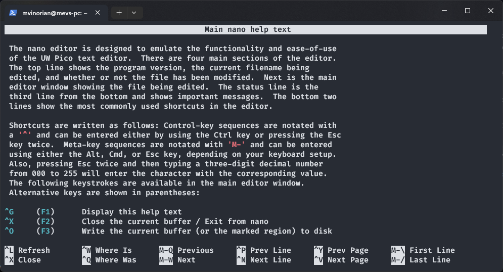
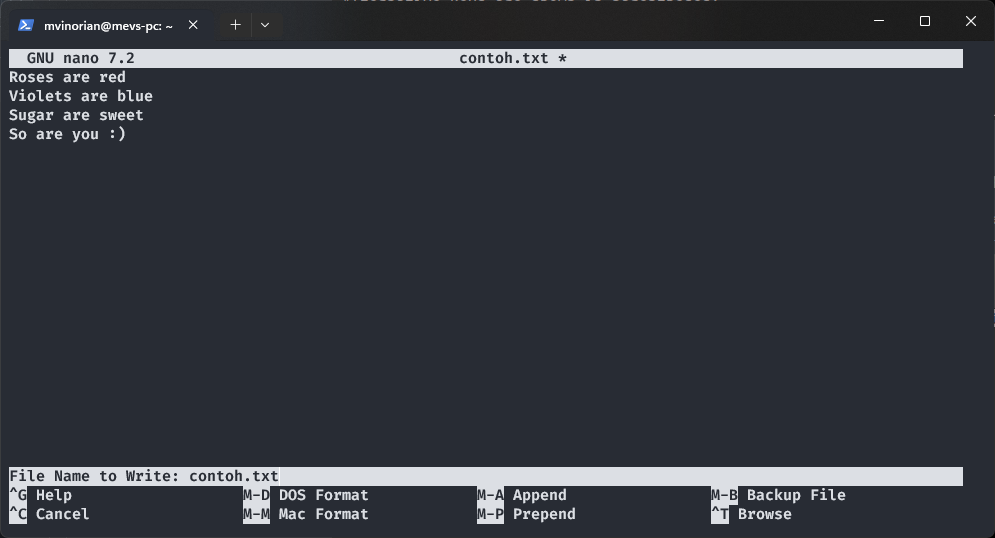

## Daftar Isi

- [Daftar Isi](#daftar-isi)
- [1. Perkenalan Linux](#perkenalan-linux)
  - [1.1. Sistem Operasi](#apa-itu-sistem-operasi)
    - [1.1.1. Fungsi Utama Sistem Operasi](#fungsi-utama-sistem-operasi)
  - [1.2. Perbedaan Linux dan OS Lainnya](#perbedaan-linux-dan-os-lainnya)
    - [1.2.1. Apa itu Linux?](#apa-itu-linux)
    - [1.2.2. Pros and Cons](#pros-and-cons)
- [2. Filesystem](#filesystem)
    - [2.1. Linux Filesystem](#linux-filesystem)
    - [2.1. Struktur Filesystem](#struktur-filesystem)
    - [2.1.= Explore Filesystem](#explore-filesystem)
- [3. Command Package Management](command-package-management)
- [4. Text Editor](#text-editor)
- [Referensi](#referensi)

# Perkenalan Linux

## Apa Itu Sistem Operasi?

Sistem operasi (OS) adalah perangkat lunak yang bertindak sebagai perantara antara perangkat keras komputer dan pengguna. Mengelola perangkat keras komputer dan menyediakan layanan penting untuk berbagai aplikasi. Menjadi jembatan bagi pengguna untuk berinteraksi dengan komputer dan komponennya.

### Fungsi Utama Sistem Operasi

- Pengelola Sumber Daya

- Manajemen Proses

- Manajemen Memori

- Manajemen File System

- User Interface

## Perbedaan Linux dan OS Lainnya

### Apa itu Linux?

<!--  -->

<!--  -->

Linux adalah nama yang diberikan kepada sistem operasi bertipe Unix. Linux merupakan salah satu contoh hasil pengembangan perangkat lunak bebas dan sumber terbuka utama (<i>open source</i>). Seperti perangkat lunak bebas dan sumber terbuka lainnya pada umumnya, kode sumber Linux dapat dimodifikasi, digunakan dan didistribusikan kembali secara bebas oleh siapa saja. Dengan kata lain, kalian pun juga bisa berkontribusi untuk mengembangkan linux menjadi sistem operasi yang lebih baik kedepannya.

### Pros and Cons

| **Kelebihan Linux (Pros)**                                     | **Kelemahan Linux (Cons)**                                        |
|-----------------------------------------------------------------|--------------------------------------------------------------------|
| Sumber Terbuka (Open Source) yang mendukung inovasi dan kebebasan pengguna | Kompatibilitas perangkat lunak terbatas                            |
| Keamanan yang kuat, kurang rentan terhadap malware dan virus      | Dukungan perangkat keras masih terbatas                            |
| Stabilitas, kinerja handal, dan jarang memerlukan rebooting        | Kurva pembelajaran curam untuk pengguna baru yang tidak terbiasa menggunakan Unix type                       |
| Berbagai distribusi untuk berbagai keperluan pengguna (distro)             | Dukungan komersial terbatas                                       |
| Kustomisasi tinggi, pengguna memiliki kontrol penuh atas sistem    | Keterbatasan aplikasi dan permainan (contoh: valorant)   |


# Filesystem 

Filesystem mendeskripsikan data yang kita punya. Dengan filesystem kita bisa letak dari suatu file atau direktrori, akses terhadap suatu data. Tanpa Filesystem, kita tidak akan mengetahui di mana sesuatu disimpan, di mana segala sesuatu dimulai atau berakhir.

## Linux Filesystem

Filesystem di Linux adalah bagian dari sistem operasi yang mengatur dan mengelola data di penyimpanan, seperti hard disk. Filesystem membantu dalam:

- Mengatur file di dalam disk
- Mengelola nama file
- Menyimpan ukuran file
- Mencatat tanggal pembuatan file
- Menyimpan informasi lain tentang file

Filesystem ini penting untuk memastikan semua data tersimpan dengan rapi dan mudah diakses.

## Struktur Filesystem

Filesystem di Linux memiliki struktur berkas hierarkis, yaitu sistem berkas yang tersusun seperti pohon:

1. Direktori Utama (Root Directory): Direktori paling atas.
2. Subdirektori: Direktori yang ada di bawah root dan direktori lainnya.

Setiap direktori dan subdirektori bisa diakses dari root directory. Biasanya, satu partisi disk punya satu filesystem, tapi bisa juga lebih dari satu. Filesystem dirancang untuk mengelola data di penyimpanan yang tidak mudah hilang (non-volatile) dan menyediakan ruang untuk menyimpan data.

Semua sistem berkas memerlukan namespace, yaitu metodologi penamaan dan pengorganisasian. Namespace menentukan proses penamaan, panjang nama file, atau subset karakter yang dapat digunakan untuk nama file. Namespace juga menentukan struktur logis file pada segmen memori, seperti penggunaan direktori untuk mengatur file tertentu.

## Struktur Direktori

Jika kita ingin belajar Linux lebih mendalam, hal yang paling dasar untuk dipahami adalah struktur direktorinya. Struktur direktori pada Linux sangat berbeda dengan Windows. Berikut adalah perbandingan sturuktur direktori baik Windows maupun Linux.

### 1.1. Struktur direktori Windows


| **Directory** | **Deskripsi**|
|---------------|--------------|
|Program Files  |Berfungsi untuk menyimpan program-program dan aplikasi yang terinstal di dalam Windows.|
|Windows        | Menyimpan segala proses juga konten-konten utama windows. Akan terjadi kerudakan system jika ada kesalahan dalam mengatur folder ini. Isi dari folder ini berupa system32, Assembly, dan Web.|
|Temp           | Digunakan untuk menyimpan file-file sementara. |
|Document and Settings | Berfungsi untuk menyimpan dokumen dan pengaturan-pengaturan user mulai dari desktop, start menu, dsb.|

### 1.2. Struktur Direktori Linux


| **Directory**       | **Deskripsi** |
|---------------------|---------------|
| / (root filesystem) | Top-level directory, Partisi dimana diletakkan "/" (root system) akan menjadi direktori sistem atau partisi pokok. Hanya bisa diakses oleh user root atau super user.|
| /bin                | User binaries, memuat program arahan yang merupakan sebagian dari sistem operasi Linux. Direktori ini meng-handle perintah stkitar Linux, seperti cd, ls, cp, dll.|
| /etc                | Configuration files, direktori yang berisi file-file konfigurasi sistem. Selain itu, juga berisi file yang dijalankan ketika start up.|
| /sbin               | System binaries, memuat file administration yang dapat diakses seperti fdisk, shutdown, reboot, dll.|
| /usr                | User programs, direktori yang berisi file-file binary, libraries, dokumentasi, dan source code dari sistem.|
| /var                | Variable files, memuat berbagai file system seperti log, direktori mail, print dan lain – lain. Yang sering kali berubah kandungannya.|
| /dev                | Device files, direktori ini berisi file perangkat untuk setiap perangkat keras yang terpasang pada sistem. Ini bukan driver perangkat, melainkan file yang mewakili setiap perangkat di komputer dan memfasilitasi akses ke perangkat tersebut.|
| /home               | Home directories, ini home direktori untuk setiap user. Setiap user pasti memiliki subdirektori di `/home`.|
| /lib                | System libraries, memuat file-file library Linux yang mendukung binary files dalam direktori `/bin` dan `/sbin`.|
| /mnt                | Mount directory, direktori untuk mounting file sistem sementara (not removeable media).|
| /media              | Removable media devices, direktori untuk mounting removable media seperi drive CD-ROM, hardisk eksternal, flashdisk, zip drive, dll.|
| /opt                | Optional add-on applications, direktori ini menyimpan file-file tambahan dari vendor-vendor tertentu. Sifatnya hanya optional. Diharapkan dengan adanya direktori ini, manajemen paket aplikasi tambahan dapat dilakukan dengan mudah.|
| /boot               | Boot loader files, Direktori yang berisi file-file yang berhubungan dengan boot loader, contohnya Grub boot manager, File Kernel initrd, vmlinux, dll.|
| /tmp                | Temporary files, direktori yang digunakan untuk menyimpan data sementara. Isi dari direktori ini dibersihkan setiap kali sistem boot.|
| /root               |Ini bukan file system root (/). Ini adalah direktori home untuk user.|

## Explore Filesystem

Untuk menjelajahi filesystem, kita bisa menggunakan beberapa commands atau perintah:

#### Navigation Command

##### 1. ls

`list`. Untuk menampilkan list atau daftar file-file apa saja yang ada disuatu directory. Parameter yang sering dipakai pada perintah ls adalah `-a`, `-l`, `-t`, `-h`, dan `-r`. Parameter digunakan untuk menentukan output yang kita inginkan. Parameter bisa digabungkan, dan urutan letak parameter tidak memengaruhi hasil.


##### 2. pwd

`print working directory`. Untuk mengetahui di directory mana kita berada sekarang.


##### 3. cd

`change directory`. Digunakan untuk pindah ke directory lain. Syntax-nya adalah `cd <nama_directory>`. Misalnya kita sedang berada di directory /home/pelatihan dan ingin berpindah ke directory `/usr/share`. Maka command yang kita gunakan adalah `cd /usr/share`.

Contoh lain:

- `cd` atau `cd ~` untuk pindah ke directory home user
- `cd /` untuk pindah ke directory root
- `cd ..` untuk pindah ke parent directory dari directory sekarang
- `cd -` untuk kembali ke working directory sebelumnya


#### Manipulation Command

##### 1. cp

`copy`. Sesuai namanya maka command ini bertugas untuk copy (salin) file atau direktori.

##### 2. mv

`move`. Digunakan untuk memindahkan suatu file atau direktori secara permanen. Command `mv` juga bisa digunakan untuk me-rename file atau direktori.

user linux akan menggunakan command package manager untuk menginstal package yang dibutuhkan. Package manager akan mengambil package yang dibutuhkan dari repository yang sudah dikonfigurasi sebelumnya. Package yang dibutuhkan tersebut bisa berupa package utama atau package dependensi. Package utama adalah package yang dibutuhkan oleh user untuk bisa berjalan. Package dependensi adalah package yang dibutuhkan oleh package utama untuk bisa berjalan.

## Command Package Management

Beberapa command yang dapat dilakukan untuk memanage package pada linux yang sering digunakan adalah sebagai berikut :

- `apt-get update`

  Command ini digunakan untuk mengupdate list package yang ada pada repository. Command ini harus dijalankan sebelum menginstal package agar package yang diinstal adalah package terbaru.

- `apt-get install <package-name>`
  Command ini digunakan untuk menginstal package yang dibutuhkan. Contohnya adalah `apt-get install nginx`.

- `apt-get remove <package-name>`
  Command ini digunakan untuk menghapus package yang sudah terinstal. Contohnya adalah `apt-get remove nginx`.

## Text Editor

Dalam linux, text editor yang sering digunakan adalah nano dan vim. Dua text editor tersebut dapat berjalan pada command line interface (CLI).

### Nano

Nano merupakan teks editor yang termasuk mudah dipahami karena terdapat shortcut pada bagian bawah layar. Untuk membuka file menggunakan nano, dapat menggunakan perintah berikut.

```sh
nano [nama-file]
```

Jika tidak bisa menggunakan perintah tersebut, berarti `nano` belum terinstall. Untuk melakukan instalasi `nano` dapat menggunakan perintah berikut.

```sh
sudo apt update
sudo apt install nano -y
```

Pada contoh kali ini akan digunakan untuk mengedit file `contoh.txt`.

```sh
nano contoh.txt
```


Pada interface tampilan shortcut, simbol `^` sama dengan tombol `Ctrl` dan simbol `M-` sama dengan tombol `Alt`. Contoh penggunaannya adalah untuk melihat daftar shortcut yang dapat digunakan pada nano menggunakan shortcut `Ctrl + G`.



Untuk keluar dari tampilan bantuan, dapat menggunakan tombol `Q`. Setelah mengubah isi dari file yang ingin diubah, file dapat disimpan menggunakan shortcut `Ctrl + O`.



Kemudian akan muncul pertanyaan `File Name to Write: ` yang dapat diisi nama hasil file yang ingin disimpan. Setelah itu dapat ditekan `Enter`.

Ketika ingin keluar dari text editor secara langsung tanpa menyimpan file, dapat menggunakan shortcut `Ctrl + X`. Tekan `N` jika tidak ingin menyimpan perubahan atau `Y` untuk menyimpan perubahannya.


## Referensi

[Pelatihan Linux](https://github.com/arsitektur-jaringan-komputer/Pelatihan-Linux/)