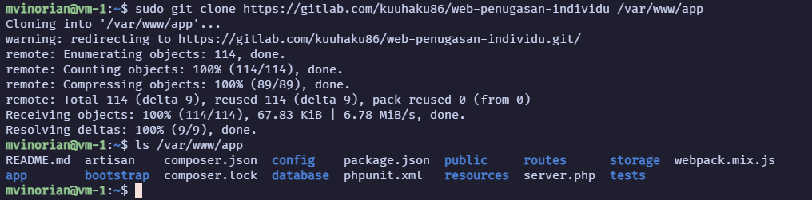

# Set Up Nginx dan Pengetahuan Reverse Proxy

## Apa Itu Reverse Proxy?

Sebelum mengenal Reverse Proxy lebih jauh, perlu diketahui bahwa Reverse Proxy dan Proxy Service yang lain, seperti Forward Proxy, adalah dua hal yang berbeda dalam hal fungsinya.

### Forward Proxy

Secara singkat Forward Proxy adalah sebuah service yang disediakan oleh suatu server, dimana server ini akan menjadi perantara bagi kita dan server atau website tujuan. jadi ketika kita mengakses suatu website yang ada di internet kita akan lebih dahulu terhubung ke Proxy Server.

Tak hanya itu, Proxy server juga cukup efektif digunakan sebagai sebuah gateway. Nantinya, semua koneksi yang dilakukan akan sesuai dengan setting gateway yang ditetapkan. Dengan begitu, tidak mudah disusupi serangan dari luar yang tidak diinginkan. Contoh aristektur sederhana yang menggunakan Proxy server.


### Reverse Proxy

Selanjutnya, Reverse Proxy adalah salah satu jenis server Proxy yang bertanggung jawab dalam meneruskan request client ke server. Reverse Proxy terletak diantara client dan server. Jadi, request yang dilakukan client akan diteruskan oleh Reverse Proxy untuk mencapai ke server. Mudahnya, Reverse Proxy ini berada diantara client dan server yang bertugas untuk menjamin pertukaran data antara client dan server berjalan dengan lancar.

Reverse Proxy biasanya diterapkan pada web server seperti Apache dan Nginx. Selain itu, dikutip dari CloudFlare, Reverse Proxy juga digunakan sebagai keamanan agar proses pertukaran request dari client ke server atau sebaliknya berjalan dengan aman.

Tidak hanya itu, Reverse Proxy juga bisa melakukan kompresi data. Data yang besar akan dilakukan kompresi sehingga menjadi data dengan ukuran yang lebih kecil. Hal itu dapat membuat pertukaran data berjalan lebih cepat. Reverse Proxy juga memiliki kemampuan untuk menyeimbangkan load atau beban server agar server tidak down.


## Bagaimana Cara Kerja Reverse Proxy?

Seperti yang sudah dijelaskan di atas, Reverse Proxy berada di antara client dan server. Fungsi utama Reverse Proxy adalah menerima dan meneruskan request dari client ke server atau sebaliknya. Alur kerja Reverse Proxy adalah sebagai berikut. Ketika client mengakses suatu website, maka request yang dilakukan akan diteruskan oleh Reverse Proxy ke server. Server akan memberikan response kepada Reverse Proxy, kemudian Reverse Proxy akan meneruskan response tersebut kepada client.

## Mengapa Harus Menggunakan Reverse Proxy?

Dalam kasus ini, akan digunakan Reverse Proxy Nginx (baca: engine-x). Nginx adalah salah satu web server yang paling populer digunakan oleh banyak website. Nginx juga memiliki kemampuan sebagai Reverse Proxy. Ada beberapa alasan mengapa harus menggunakan Reverse Proxy Nginx, diantaranya adalah sebagai berikut.

- **Load Balancing**: Nginx dapat digunakan sebagai Reverse Proxy untuk menyeimbangkan beban server. Dengan begitu, server tidak akan down saat terjadi lonjakan traffic.

- **Caching**: Nginx juga memiliki kemampuan untuk melakukan caching. Data yang sering diakses akan disimpan di cache. Sehingga, ketika data tersebut diakses kembali, data tersebut akan diambil dari cache. Hal ini dapat mempercepat proses pertukaran data.

- **Compression**: Nginx juga dapat melakukan kompresi data. Data yang besar akan diubah menjadi data yang lebih kecil. Sehingga, proses pertukaran data akan berjalan lebih cepat.

- **Increased Security**: Nginx juga dapat digunakan sebagai Reverse Proxy untuk meningkatkan keamanan server. Nginx dapat melakukan filtering terhadap request yang masuk. Sehingga, request yang masuk ke server akan lebih aman.

## Implementasi Reverse Proxy Nginx

### Instalasi Nginx

Sebelum mengimplementasikan Reverse Proxy Nginx, pastikan Nginx sudah terinstall di server. Jika belum, silahkan install Nginx terlebih dahulu.

```bash
sudo apt update
sudo apt install nginx
```

Setelah Nginx terinstall, pastikan Nginx sudah berjalan dengan baik.

```bash
service nginx status
```


Selain itu, pastikan server sudah dapat diakses melalui browser dengan menggunakan IP Public dan sudah dibuka port 80 untuk akses Inbound HTTP. Ketika kita membuka IP Publik menggunakan browser, akan terlihat halaman default Nginx seperti berikut.


### Persiapan Aplikasi

Untuk keperluan implementasi Reverse Proxy Nginx, akan digunakan aplikasi laravel dari repository [di sini](https://gitlab.com/kuuhaku86/web-penugasan-individu). Oleh karena itu, aplikasi laravel tersebut perlu kita lakukan clone terlebih dahulu.

```bash
git clone https://gitlab.com/kuuhaku86/web-penugasan-individu /var/www/app
```

Lakukan clone aplikasi laravel tersebut di dalam direktori `/var/www/`. Untuk nama direktori aplikasi laravel, bisa disesuaikan dengan keinginan. Pastikan aplikasi sudah berada pada direktori `/var/www/app` dengan perintah berikut.

```bash
ls /var/www/app
```



### Konfigurasi Aplikasi Laravel

Pastikan aplikasi laravel sudah dapat berjalan dengan baik mengikuti langkah-langkah pada modul sebelumnya. Dapat menggunakan perintah berikut untuk menjalankan aplikasi laravel.

```bash
cd /var/www/app
php artisan serve
```


### Konfigurasi Nginx

Setelah aplikasi laravel sudah berjalan dengan baik, selanjutnya adalah melakukan konfigurasi Nginx. Konfigurasi Nginx untuk Reverse Proxy dapat dilakukan dengan membuat file konfigurasi baru di dalam direktori `/etc/nginx/sites-available/`. File konfigurasi baru dapat dibuat sesuai dengan text editor yang diinginkan.

```bash
sudo nano /etc/nginx/sites-available/app
```

Kemudian, isi file konfigurasi tersebut dengan konfigurasi berikut.

```nginx
server {
  listen 80;
  server_name app.local;

  root /var/www/app/public;
  index index.php;

  location / {
    try_files $uri $uri/ /index.php?$query_string;
  }

  location ~ \.php$ {
    include snippets/fastcgi-php.conf;
    fastcgi_pass unix:/var/run/php/php8.0-fpm.sock;
  }

  location ~ /\.ht {
    deny all;
  }
}
```

**Catatan**:

- `liste`: Menentukan port yang digunakan oleh Nginx.

- `server_name`: Menentukan nama domain yang digunakan oleh aplikasi laravel. Dapat diganti dengan IP Public server, nama domain, atau localhost.

- `root`: Menentukan direktori aplikasi laravel.

- `index`: Menentukan urutan file index yang akan diakses ketika ada request masuk.

- `location /`: Menentukan bagian konfigurasi untuk request yang masuk ke root aplikasi laravel.

- `location ~ \.php$`: Menentukan bagian konfigurasi untuk request yang masuk ke file PHP. Semua request yang masuk ke file PHP akan diteruskan ke PHP-FPM.

- `locatoin ~ /\.ht`: Menentukan bagian konfigurasi untuk request yang masuk ke file `.ht`. Semua request yang masuk ke file `.ht` akan ditolak.

Setelah itu, konfigurasi dapat ditambahkan pada direktori `/etc/nginx/sites-enabled/` dengan perintah berikut.

```bash
sudo ln -s /etc/nginx/sites-available/app /etc/nginx/sites-enabled/
```

Perintah di atas akan melakukan _symbolic link_ dari file konfigurasi yang sudah dibuat sebelumnya ke direktori `/etc/nginx/sites-enabled/`. Setelah itu, pastikan konfigurasi sudah benar dengan perintah berikut.

```bash
sudo nginx -t
```

Setelah konfigurasi sudah benar, selanjutnya adalah melakukan reload Nginx.

```bash
sudo service nginx reload
```

Pastikan tidak ada konfigurasi default Nginx pada direktori `/etc/nginx/sites-enabled/` dengan perintah berikut.

```bash
ls /etc/nginx/sites-enabled/
```

Jika masih ada konfigurasi default Nginx, maka hapus konfigurasi tersebut dengan perintah berikut.

```bash
sudo rm /etc/nginx/sites-enabled/default
```

Setelah itu, pastikan aplikasi laravel sudah dapat diakses melalui browser dengan menggunakan IP Public server.


