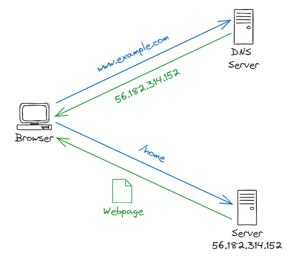
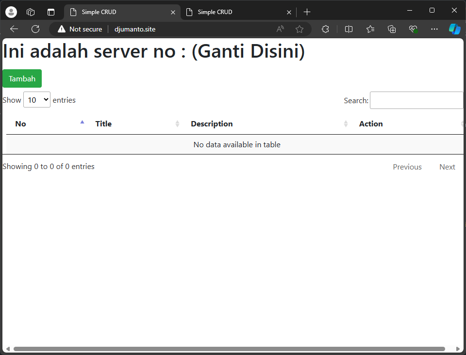
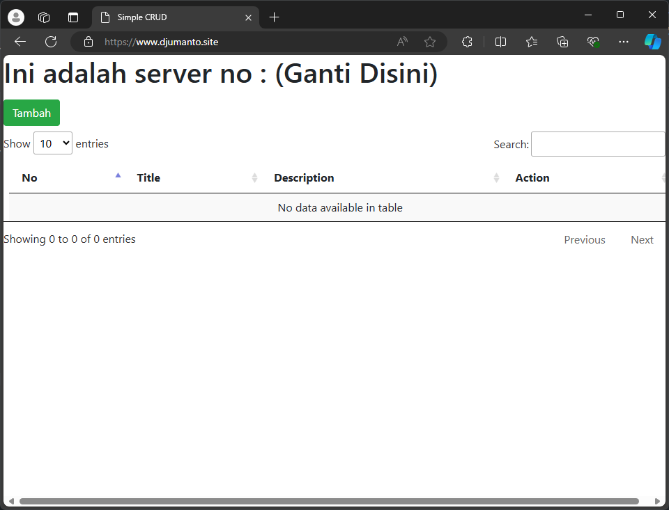

# DNS dan SSL

## Apa Itu DNS?

DNS (Domain Name System) adalah sistem yang menghubungkan antara nama domain dengan alamat IP. DNS memetakan nama domain yang mudah diingat oleh manusia ke alamat IP yang dimengerti oleh komputer. DNS memungkinkan kita untuk mengakses situs web dengan mengetikkan nama domain tanpa perlu mengingat alamat IP dari situs web tersebut.

## Bagaimana Cara Kerja DNS?



Client akan meminta alamt IP dari suatu domain ke DNS server. Jika pada DNS server data alamat IP dari DNS server tersebut ada maka akan di return alamat IP nya kembali menuju client. Jika DNS server tersebut tidak memiliki alamat IP dari domain tersebut maka dia akan bertanya kepada DNS server yang lain sampai alamat domain itu ditemukan.

## Cara Menambahkan Akses DNS pada Web Server

Ubah konfigurasi Nginx yang pernah dibuat pada `/etc/nginx/sites-available/app` dengan menggati `server_name` pada file konfigurasi Nginx.

```nginx
server {
  listen 80;
  server_name djumanto.site www.djumanto.site;

  root /var/www/app/public;
  index index.php;

  location / {
    try_files $uri $uri/ /index.php?$query_string;
  }

  location ~ \.php$ {
    include snippets/fastcgi-php.conf;
    fastcgi_pass unix:/var/run/php/php8.0-fpm.sock;
  }

  location ~ /\.ht {
    deny all;
  }
}
```

Setelah itu lakukan reload pada Nginx dengan perintah berikut.

```bash
sudo service nginx reload
```

Kemudian dapat diakses melalui web browser menggunakan nama domain yang sudah diatur pada konfigurasi Nginx.



## Apa Itu SSL?

SSL (Secure Sockets Layer) adalah protokol keamanan yang digunakan untuk mengamankan koneksi antara client dan server. SSL memastikan bahwa data yang dikirimkan antara client dan server tetap aman dan tidak dapat diakses oleh pihak yang tidak berwenang.

## HTTP vs HTTPS

**HTTP (Hypertext Transfer Protocol)** adalah protokol yang digunakan untuk mentransfer data antara client dan server. Data yang dikirimkan melalui HTTP tidak dienkripsi dan dapat dibaca oleh pihak yang tidak berwenang. Sedangkan **HTTPS (Hypertext Transfer Protocol Secure)** adalah versi aman dari HTTP yang menggunakan SSL/TLS untuk mengenkripsi data yang dikirimkan antara client dan server.

## Cara Mengaktifkan SSL pada Nginx

### 1. Instalasi Certbot

Certbot adalah alat sumber terbuka yang digunakan untuk menghasilkan dan memperbarui sertifikat SSL secara otomatis. Certbot mendukung berbagai server web, termasuk Apache, Nginx, dan banyak lainnya.

Untuk menginstal Certbot pada Ubuntu, jalankan perintah berikut.

```bash
sudo apt install certbot python3-certbot-nginx
```

### 2. Mengaktifkan SSL pada Nginx

Certbot menyediakan perintah yang memungkinkan kita untuk mengaktifkan SSL pada Nginx dengan mudah. Jalankan perintah berikut untuk mengaktifkan SSL pada Nginx.

```bash
sudo certbot --nginx -d djumanto.site -d www.djumanto.site
```

Perintah di atas akan menghasilkan sertifikat SSL dan mengonfigurasi Nginx untuk menggunakan sertifikat tersebut. Certbot akan mengubah konfigurasi Nginx yang ada dan menambahkan konfigurasi SSL. Berikut adalah contoh konfigurasi Nginx yang telah diubah oleh Certbot.

```nginx
server {
  server_name djumanto.site www.djumanto.site;

  root /var/www/app/public;
  index index.php;

  location / {
    try_files $uri $uri/ /index.php?$query_string;
  }

  location ~ \.php$ {
    include snippets/fastcgi-php.conf;
    fastcgi_pass unix:/var/run/php/php8.0-fpm.sock;
  }

  location ~ /\.ht {
    deny all;
  }

    listen 443 ssl; # managed by Certbot
    ssl_certificate /etc/letsencrypt/live/djumanto.site/fullchain.pem; # managed by Certbot
    ssl_certificate_key /etc/letsencrypt/live/djumanto.site/privkey.pem; # managed by Certbot
    include /etc/letsencrypt/options-ssl-nginx.conf; # managed by Certbot
    ssl_dhparam /etc/letsencrypt/ssl-dhparams.pem; # managed by Certbot
}
server {
    if ($host = www.djumanto.site) {
        return 301 https://$host$request_uri;
    } # managed by Certbot


    if ($host = djumanto.site) {
        return 301 https://$host$request_uri;
    } # managed by Certbot


  listen 80;
  server_name djumanto.site www.djumanto.site;
    return 404; # managed by Certbot
}
```

Setelah itu, perlu dilakukan reload pada Nginx dengan perintah berikut.

```bash
sudo service nginx reload
```

Kemudian, akses situs web melalui web browser menggunakan protokol HTTPS.


