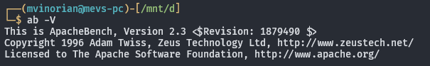
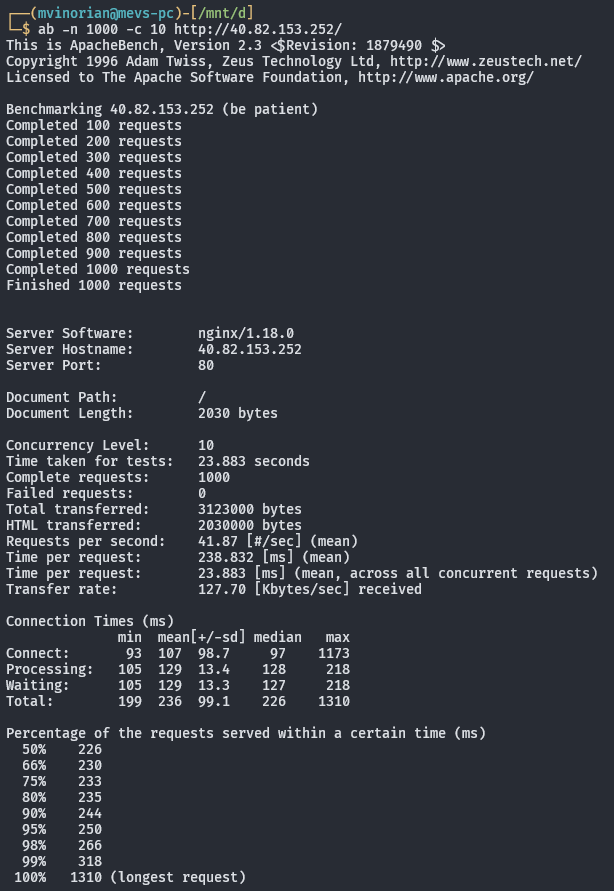
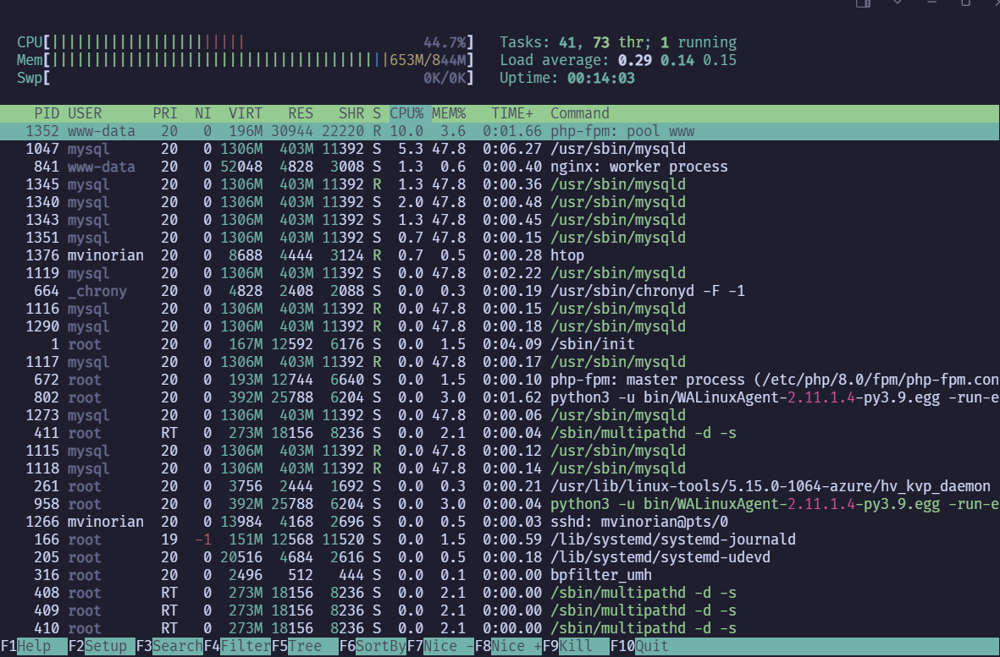

# Load Testing Dasar

## Apa Itu Load Testing?

Load Testing adalah jenis pengujian yang dilakukan untuk mengetahui seberapa besar beban yang dapat ditangani oleh suatu sistem. Pengujian ini bertujuan untuk menentukan batas maksimal kapasitas sistem dalam menangani pengguna atau permintaan secara bersamaan. Selain itu, Load Testing juga dapat digunakan untuk mengevaluasi kecepatan respon dari suatu sistem ketika menerima beban yang besar, membantu dalam mengidentifikasi bottleneck, dan memastikan bahwa aplikasi tetap stabil dan berkinerja baik di bawah kondisi beban puncak. Load Testing biasanya dilakukan untuk mengetahui performa dari suatu sistem, baik dari segi waktu respon, throughput, dan penggunaan sumber daya seperti CPU dan memori.

Load Testing dapat dilakukan dengan menggunakan berbagai macam tools. Beberapa tools yang sering digunakan untuk Load Testing adalah Apache Benchmark, Apache JMeter, LoadRunner, Gatling, dan sebagainya. Masing-masing tool memiliki kelebihan dan kekurangan tersendiri, serta berbagai fitur yang dapat disesuaikan dengan kebutuhan pengujian. Pada modul ini, kita akan menggunakan Apache Benchmark untuk melakukan Load Testing.

## Mengapa Harus Melakukan Load Testing?

Melakukan Load Testing sangat penting karena berbagai alasan. Pertama, Load Testing membantu dalam mengidentifikasi potensi masalah performa sebelum aplikasi atau sistem dirilis ke lingkungan produksi. Dengan mengetahui batas maksimal kapasitas sistem, pengembang dapat mengantisipasi dan memperbaiki masalah yang mungkin timbul di kemudian hari. Kedua, Load Testing memastikan bahwa sistem dapat menangani lonjakan permintaan yang tidak terduga tanpa mengalami downtime atau penurunan performa. Hal ini sangat penting terutama untuk aplikasi yang menangani transaksi bisnis kritis atau memiliki basis pengguna yang besar.

Selain itu, Load Testing juga memberikan wawasan tentang bagaimana sistem akan berperilaku di bawah beban yang berbeda, memungkinkan tim pengembang dan operasi untuk melakukan penyesuaian dan optimasi yang diperlukan. Ini termasuk peningkatan infrastruktur, optimasi kode, dan pengaturan konfigurasi yang lebih efisien. Dengan demikian, Load Testing membantu dalam menjaga kepuasan pengguna dengan memastikan bahwa aplikasi atau sistem tetap responsif dan dapat diandalkan.

## Demonstrasi Load Testing Menggunakan Apache Benchmark

Apache Benchmark (ab) adalah salah satu tool sederhana namun kuat yang sering digunakan untuk melakukan Load Testing pada server web. Alat ini memungkinkan pengguna untuk mengirimkan sejumlah besar permintaan HTTP/HTTPS ke server tertentu dan mengukur kinerja server dalam menanggapi permintaan tersebut. Berikut adalah langkah-langkah dasar untuk melakukan Load Testing menggunakan Apache Benchmark.

1. Instalasi Apache Benchmark

   Apache Benchmark perlu diinstall pada komputer client untuk melakukan Load Testing. Apache Benchmark biasanya sudah terinstal secara default pada sistem operasi berbasis Unix seperti Linux dan macOS. Namun, jika tidak ada, dapat diinstall dengan menjalankan perintah berikut.

   ```bash
   sudo apt install apache2-utils
   ```

   Untuk pengecekan apakah Apache Benchmark sudah terinstal, dapat melakukan perintah berikut.

   ```bash
    ab -V
   ```

   

2. Pengujian

   Untuk melakukan mengirimkan 1000 permintaan secara bersamaan dengan 10 permintaan secara paralel dapat menggunakan perintah berikut.

   ```bash
    ab -n 1000 -c 10 <URL>
   ```

   Penjelasan:

   - `-n 1000`: Jumlah total permintaan yang akan dikirimkan.

   - `-c 10`: Jumlah permintaan yang dikirimkan secara bersamaan.

   - `<URL>`: URL yang akan diuji.

   Berikut adalah hasil dari Load Testing menggunakan Apache Benchmark.

   

   Penjelasan:

   - `Server Software`: Nama server web yang digunakan.

   - `Server Hostname`: Nama host server (DNS atau IP Address).

   - `Server Port`: Port server yang digunakan.

   - `Document Path`: Path dari dokumen yang diuji.

   - `Document Length`: Panjang dokumen yang diuji dalam bytes.

   - `Concurrency Level`: Jumlah permintaan yang dikirimkan secara bersamaan.

   - `Time taken for tests`: Waktu total yang dibutuhkan untuk melakukan pengujian.

   - `Complete requests`: Jumlah permintaan yang berhasil diselesaikan.

   - `Failed requests`: Jumlah permintaan yang gagal.

   - `Total transferred`: Total data yang ditransfer dalam bytes.

   - `HTML transferred`: Total data HTML yang ditransfer dalam bytes.

   - `Requests per second`: Jumlah permintaan yang berhasil diselesaikan per detik.

   - `Time per request`: Nilai pertama adalah rata-rata waktu yang dibutuhkan untuk
     menyelesaikan satu permintaan. Nilai kedua adalah rata-rata waktu yang dibutuhkan untuk menyelesaikan satu permintaan tanpa memperhitungkan waktu yang dibutuhkan untuk koneksi.
   - `Transfer rate`: Kecepatan transfer data rata-rata.

3. Monitoring

   Selain itu, kita juga dapat menggunakan alat monitoring seperti `htop` untuk memantau penggunaan sumber daya pada server selama Load Testing berlangsung.

   ```bash
   htop
   ```

   

   Dapat dilihat penggunaan sumber daya seperti CPU dan Memori selama Load Testing berlangsung. Dengan melakukan Load Testing menggunakan Apache Benchmark, kita dapat mengetahui seberapa besar beban yang dapat ditangani oleh server web, kecepatan respon server, dan penggunaan sumber daya selama pengujian berlangsung. Hal ini membantu dalam mengevaluasi performa server dan mengidentifikasi masalah performa yang mungkin timbul di kemudian hari.
